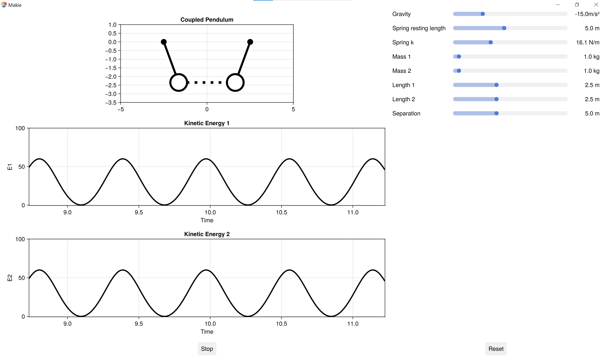

## Real-Time Differential Equation Solver: Interactive Pendulum Demo

This project was developed in a few hours during a Doctoral School workshop at UGent to showcase how well-integrated Julia packages can create a real-time, interactive simulation of pendulum physics.

I have dabbled in real-time simulations for a long time, experimenting with similar setups in tools like p5.js ([example](https://editor.p5js.org/20akshay00/sketches/NuIwwXqnR)) and Godot ([educational projects](https://itch.io/queue/c/5223829/educational-projects?game_id=3070889)). While these tools excel in interactivity, they lack the scientific libraries needed for efficient and accurate simulations. Conversely, I had wondered if Julia might suffer from poor interactivity instead, so this project served to see whether this was the case.

### Workflow

- The system's Lagrangian is defined using [ModelingToolkit.jl](https://mtk.sciml.ai/stable/), which automatically generates the coupled second-order differential equations of motion.
- These equations are solved incrementally using `step!` from [DifferentialEquations.jl](https://diffeq.sciml.ai/stable/), enabling real-time updates.
- Visualization and interactivity are handled with [Makie.jl](https://makie.juliaplots.org/stable/), linking Observables to the solver output and using sliders and mouse input to adjust parameters dynamically.

The demo currently supports simple and double pendulum models and primarily serves as a proof of concept for interactive physics simulations in Julia. Much of the Makie setup draws inspiration from [Datseris’ tutorial](https://gist.github.com/Datseris/4b9d25a3ddb3936d3b83d3037f8188dd).

### Known Issues

- A noticeable lag occurs during the first ~300 frames while energy plots populate.
- Energy plot y-axis limits are hardcoded.
- Some slider-controlled parameters only update after pressing reset, not instantly.

These issues could be addressed but have been left as-is since the code remains somewhat messy and the workshop has concluded.